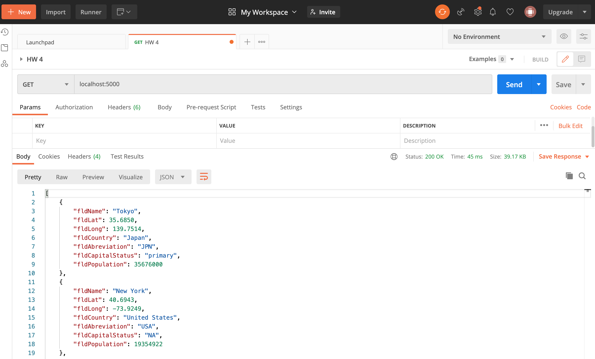
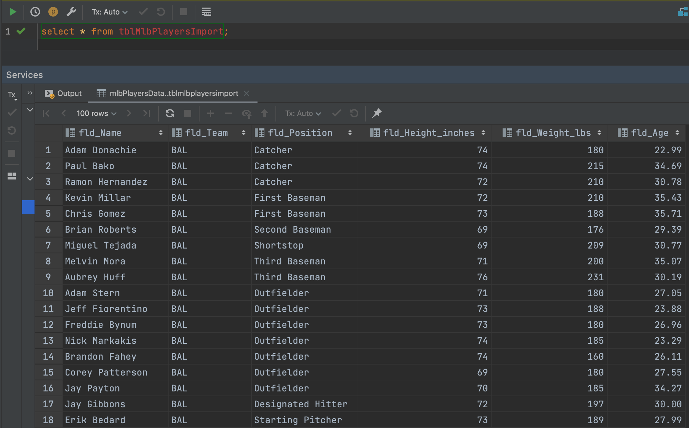

# IS 601 - Homework 5

## Project Description
This project is a homework assignment to learn how to get Pycharm setup with Docker, Flask, and MySQL.

It is a continuation of the previous assignment, where now HTML forms were created to add new records, update records, and delete records.

The data was taken from [this](https://people.sc.fsu.edu/~jburkardt/data/csv/csv.html) csv source and converted to SQL statements using [this](https://sqlizer.io/#/) online tool.

## Postman Screenshot

## MySQL Data Screenshot
